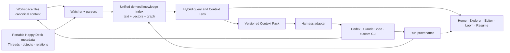

# Happy Desk — Initial Product Requirements Document

**Status:** Draft for product discovery  
**Version:** 0.2  
**Date:** 2026-08-05  
**Product brief:** [PRODUCT-BRIEF.md](PRODUCT-BRIEF.md)  
**Signature UX concept:** [UX-CONCEPT-KNOWLEDGE-LOOM.md](UX-CONCEPT-KNOWLEDGE-LOOM.md)  
**Decisions log:** [GRILL-DECISIONS.md](GRILL-DECISIONS.md)  
**Design system:** [../design-system/happy-desk/MASTER.md](../design-system/happy-desk/MASTER.md)

## 1. Purpose

This PRD defines the first testable version of Happy Desk: a local-first desktop application that opens an existing folder, derives an explainable knowledge and retrieval layer, lets the user **resume Threads**, compose a task-specific Context Pack, and run a native CLI agent against that folder.

The first release is not intended to replace a full IDE, Obsidian, a general agent platform, or the operating system. It validates:

> **Resume and continue real multi-thread work without manually reconstructing context — then deliberately hand a visible pack to a native agent.**

The defining experience is the **Knowledge Loom** oriented around **Thread Resume** (signature) and **Context Packs** (execution). Incoming information becomes progressively available, can be captured/promoted into explicit knowledge, and remains traceable from source through relationships into packs and agent-produced work.

## 2. Target users

### Primary: Alex (AI-native builder, ND switching pattern)

A developer, researcher, consultant, writer, or technical lead who works across Markdown, code, documents, and agent CLIs. They already use folders and Git, hold many live threads, lose time after interrupts, and care about exactly what an AI can see and change. They need external structure **without shame**.

Concrete persona: see brief / GRILL D11.

### Secondary: structured knowledge worker

A user with a folder-based knowledge base who wants stronger retrieval, typed relationships, and agent-assisted outputs without moving content into a hosted knowledge system.

## 3. Jobs and outcomes

| Job | Desired outcome |
|---|---|
| Return after interrupt / time away | Resume chosen Thread to usable cursor in ≤30s / ≤2 clicks from Home. |
| Hold many unfinished streams | Active + recent Threads on Home; park without guilt; full mess on request. |
| Capture an impulse | Open Loop (or note) in ≤2 seconds without ontology pick. |
| Find relevant material | Exact + semantic + connected context, with reasons. |
| Understand relationships | Strongest local paths without a global hairball. |
| Prepare an AI task | Bounded, inspectable Context Pack from ranked list + pins + budget. |
| Run an agent | Codex, Claude Code, or custom CLI in native mode. |
| Review work | File changes primary; high-impact knowledge deltas selective. |
| Continue later | Threads, decisions, open loops, and run provenance in portable form. |

## 4. Release scope

### 4.1 Must-have vertical slice

1. Open an arbitrary local folder as a workspace.
2. Browse files immediately, independent of index state.
3. **Home Threads** surface (Active ≤7, Recently touched, scoped Needs-you).
4. **Thread Resume** restoring anchor, cursor, and last scale.
5. **Capture** → Open Loop in ≤2 seconds from editor/empty/agent selection/search.
6. View and edit Markdown and plain-text files safely.
7. Incrementally index supported text files and Markdown structure.
8. Create a graph from containment, explicit links, and (behind proposals) semantic similarity.
9. Search using filename/path, full text, vectors, and graph expansion.
10. Explore a local neighborhood with hop/strength/type/scope; list/table equivalent required.
11. Explain every retrieved item and inferred relationship.
12. Pin results into a versioned Context Pack with a visible budget (**pack-first** ranked list).
13. Run at least one native CLI harness using that pack.
14. Capture run status, output, touched files; file diff + selective knowledge proposals.
15. Knowledge Pulse as non-blocking capability coverage.

### 4.2 Explicitly out of scope for the first vertical slice

- Real-time multi-user collaboration.
- Cloud sync or a hosted account system as required path.
- Email, calendar, Jira, Confluence, Teams, Slack, browser-history workspace types.
- System-wide agent OS shell or “replace the OS” product IA.
- Full Word, PowerPoint, or spreadsheet editing.
- A plugin marketplace.
- Autonomous multi-agent orchestration.
- Mobile applications.
- A complete ontology designer.
- Full IDE features (debugging, language servers, extension compatibility).
- A global graph view optimized for thousands of simultaneously rendered nodes.
- Atlas / Time Rail scrubbing as required for Kill tests (may ship later).

### 4.3 OS horizon fence (D18)

Until Kill tests A and B pass with user preference vs status quo, do not commit IA, metaphor extensions, or roadmap items for mail/calendar/chat/browser-as-workspace or OS-shell replacement. North-star prose may mention the lifecycle could later wrap more digital-life sources **only if** they map to Arrived → Decoded → Connected → Curated → Operational and remain exportable/non-siloed.

## 5. Functional requirements

### FR-1 — Folder workspace

- The user can open a folder without importing, moving, or converting its contents.
- The folder may be a Git repository, a Git worktree, or an unversioned directory.
- The user can clone a remote repository through the normal Git workflow and then open/index the resulting local folder.
- The file tree is available before background indexing completes.
- Workspace configuration supports include/exclude globs, symlink policy, maximum file size, and private paths.
- Common generated and secret-bearing paths are excluded by safe defaults and can be reviewed.
- A file watcher incrementally handles create, modify, rename, and delete events.
- The UI exposes index status / Knowledge Pulse, errors, last successful update, and a rebuild command.
- Closing Happy Desk never leaves user content locked or dependent on the application.
- Git remains optional; Happy Desk functionality cannot require a remote origin.
- Known workspaces must not force a blocking preflight wizard on every open.

### FR-2 — Viewer and editor

- The first release supports Markdown and plain text editing with atomic saves.
- Markdown supports headings, links, wiki-style links, frontmatter, task lists, and source mode.
- External file modifications trigger conflict detection rather than silent overwrite.
- Unsupported formats open in a safe preview, system application, or read-only metadata view.
- Navigation between linked artifacts preserves back/forward history.
- Editor, graph, search, and Thread selections refer to the same active artifact identity model.

### FR-3 — Incremental indexing

- Each indexed file receives a stable URI, content hash, modification metadata, and parser version.
- Markdown indexing extracts headings, links, tags, frontmatter, tasks, and addressable chunks.
- Plain text is chunked with stable boundaries where possible.
- Embeddings record the provider, model, dimensions, and source content hash.
- Re-indexing unchanged content does not recompute parsing or embeddings.
- Deleted artifacts and stale derived relationships are removed or tombstoned deterministically.
- The system can rebuild the complete derived index from the workspace and portable Happy Desk metadata.
- Indexing must not modify source files.
- Pulse reports capability coverage (exact / semantic / graph); never a fake percentage while totals grow.

### FR-4 — Knowledge graph

- The graph supports artifacts, chunks, work objects (including Threads), concepts, and agent runs.
- Edges store type, direction, strength, confidence, source, evidence, timestamps, and indexer version.
- Authored, structural, extracted, semantic, behavioral, and agent-produced edges are visibly distinct.
- Users can create typed relationships, correct metadata, accept proposals, and suppress inferred edges.
- Manual decisions survive a full index rebuild.
- Default neighborhood: **authored + structural**; inferred proposals capped and behind toggle.
- Unreviewed `proposed` edges/nodes **must not** enter default retrieval or Context Packs.
- Controls include hop count, minimum strength, relationship types, node types, folders, and dates.
- Selecting an edge shows why it exists and the evidence used to create it.
- A list or table presents the same neighborhood for keyboard and screen-reader access.
- Default visual graph capped (e.g. 300 nodes) with aggregation explained when exceeded.

### FR-5 — Hybrid search

- Search can combine path/name matching, full-text ranking, vector similarity, and graph propagation.
- The user can adjust or choose presets for lexical, semantic, graph, and recency weights.
- Search can be scoped by folder, artifact type, work-object type, date, and privacy boundary.
- Each result displays its score components and strongest path to the query or anchor.
- Exact filename, heading, symbol, and explicit-link matches receive predictable priority.
- Results can be pinned, excluded, previewed, opened, or Captured without leaving the search flow.

### FR-6 — Context Lens and Context Packs

- The anchor can be a file, selection, work object, Thread, graph node, search query, or combination.
- The Context Lens exposes hops, minimum relationship strength, relationship types, blend weights, scope, and budget.
- The **ranked candidate list** is sufficient to compose a pack without using Loom scales.
- The candidate list updates as controls change and never hides explicit pins.
- The user can inspect the reason and path for every candidate.
- The user can freeze the current selection into an immutable Context Pack revision.
- A Context Pack records the objective, anchors, included items/chunks, reasons, scores, paths, hashes, exclusions, estimated tokens, creation time, and retrieval configuration.
- Packs can be duplicated, edited into a new revision, exported, and associated with Threads and agent runs.
- If a referenced file changes after freezing, the UI shows that the pack is stale rather than silently changing it.
- Act mode surfaces budget, exclusions, privacy blocks, and why-included loudly.

### FR-7 — Native CLI agents

- Harness support is adapter-based rather than model-specific in the core.
- The first presets target Codex and Claude Code; a custom executable preset is required.
- An adapter declares executable, arguments, environment policy, working directory, PTY needs, context injection, permission behavior, completion detection, and optional worktree support.
- Before launch, the UI shows the exact executable, working directory, objective, Context Pack, and permissions.
- The process runs as a real child process and streams native output into an Agent Dock.
- Happy Desk does not impersonate or flatten harness-native approval prompts.
- A run records start/end time, exit status, harness/version when detectable, Context Pack revision, output log location, and files changed.
- Git worktree isolation can be added after the direct-workspace path is proven.
- When Git is present, a run records the starting branch/commit and resulting diff or commits.
- Agent-created or changed files trigger the same watcher and indexing path as manual edits.

### FR-8 — Portable work objects

- Initial work-object types include Thread, Project, Topic, Decision, Open Loop, Task, Argument, Deliverable, Person, and Source.
- Work objects can be represented in Markdown/frontmatter or portable sidecar metadata under `.happy-desk/`.
- The UI can create at least Thread, Decision, Open Loop, and Task objects.
- Work-object IDs remain stable across file rename and index rebuild where identity evidence permits.
- User-authored relationships and decisions cannot exist only in an opaque cache.
- Thread resume cursors (anchor URI, selection, scale, lens preset, last pack ref) must round-trip portably enough to meet switch-cost targets on the same machine; cross-machine best-effort is acceptable in v1.

### FR-9 — Threads, Home, Capture, and resume

- Home shows Active (user-pinned, default ≤7), Recently touched (capped), and Needs-you scoped to those Threads.
- Home must not default to a global unfinished-work shame list or workspace Atlas.
- Resuming a Thread restores anchor + cursor + last scale; optional one-line “while you were away” for high-impact items only (Orient = quiet trust).
- Parking a Thread removes it from Active without destructive messaging.
- Capture gesture creates an Open Loop (or quick note) in ≤2 seconds with optional current anchor and provenance; no required type pick mid-impulse.
- Promotion/refine is available after capture.
- Resume view / while-you-were-away may use deterministic templates; generative summaries optional and must cite sources.

### FR-10 — Review after agent runs

- File diff is the primary review surface.
- Knowledge review is exception-based: highlight new Decisions/claims, contradictions, and edges that would affect future packs; collapse low-confidence bulk.
- Accepting file changes must not auto-accept inferred knowledge.
- Unreviewed agent assertions remain `proposed` and stay out of default retrieval/packs.

### FR-11 — Weave (Writing Feather)

- While editing in Source, the user can invoke **Weave** (shortcut, Build Shelf feather, command palette) to peek at relations of the current focus.
- Peek shows two bands: **Woven** (authored/structural/accepted) and **Likely** (anticipatory proposals).
- Likely items use distinct dashed/anticipatory labeling and must not enter default retrieval or Context Packs until explicit Pin, Relate, or Promote.
- Right rail provides tabs **Why | Weave | Pack**; Act mode prefers Pack; Orient/Resume leaves Weave closed.
- Optional under-editor dock; Esc returns focus to the caret; typing must not steal focus into Weave.
- Optional whisper gutter ticks default off until first Weave use or preference.
- Actions from a row: open neighborhood/structure, Capture, Relate, Pin to pack, Suppress.
- FR-11 is **not** required to pass Kill tests A/B; it is the next exploration love-feature after the kill-test loop works.

## 6. Information and relationship model

### 6.1 Minimal node schema

```text
Node
  id                 stable identifier
  kind               artifact | chunk | concept | work_object | agent_run | thread
  subtype            file | folder | decision | task | open_loop | thread | symbol | ...
  uri                portable workspace-relative identifier when possible
  title
  body/summary        optional indexed text
  content_hash
  metadata           includes resume cursor fields for threads
  created_at
  updated_at
```

### 6.2 Minimal edge schema

```text
Edge
  from_id
  to_id
  kind               links_to | contains | mentions | supports | ...
  direction
  strength           degree of relationship, 0..1
  confidence         certainty of the assertion, 0..1
  source             authored | structural | extracted | semantic | behavioral | agent
  evidence_uri       source location or derivation record
  indexer_version
  created_at
  valid_from/to
  review_state       proposed | accepted | suppressed
```

### 6.3 Initial relation vocabulary

`contains`, `links_to`, `mentions`, `similar_to`, `belongs_to`, `supports`, `contradicts`, `supersedes`, `depends_on`, `cites`, `produced_as`, `used_in_run`, `modified_in_run`, and `anchored_in` (Thread → artifact).

The vocabulary stays small. New types require a retrieval, navigation, or workflow use case.

### 6.4 Identity / rebinding (D5)

- Continuity = addressable identity + explicit rebinding; never silent retargeting.
- Source drift: sticky citation by content hash + span; banner to re-link or accept new span.
- One span may parent multiple work objects; breadcrumb `file › chunk › Decision`.

## 7. System design hypothesis



### Provisional desktop stack

- Tauri 2 desktop shell.
- React and TypeScript UI following [design-system/happy-desk/MASTER.md](../design-system/happy-desk/MASTER.md).
- CodeMirror 6 for the first editor.
- Cytoscape.js or Sigma.js for local graph rendering, selected by a prototype benchmark.
- Rust core for filesystem watching, indexing, database access, process/PTY control, and native packaging.
- A thin `KnowledgeIndex` interface so the storage engine can be changed after the spike.

This is a hypothesis, not yet an architecture decision.

### Storage boundary

- **Filesystem/Git:** canonical content, human-authored knowledge, reviewable metadata, history, branches, collaboration, backup, and transport.
- **Embedded SurrealDB:** local structured projections, chunks, embeddings, full-text indexes, inferred relationships, retrieval state, and fast multi-hop queries.
- **Application storage:** machine-specific settings, private Context Packs, unsanitized run logs, credentials references, and disposable caches.

Suggested portable layout:

```text
.happy-desk/
  workspace.yaml          # portable workspace configuration
  threads/                # thread metadata + resume cursors
  relations/              # authored or accepted relationships
  objects/                # decisions, open loops, tasks, saved views
  contexts/               # only explicitly promoted/sanitized packs
  .gitignore              # index, caches, logs, and machine state
```

## 8. Knowledge engine decision

SurrealDB remains the provisional first spike per [KNOWLEDGE-ENGINE.md](KNOWLEDGE-ENGINE.md). Adoption requires benchmark + BSL 1.1 review. LadybugDB, CozoDB, and SQLite remain alternatives. Thin `KnowledgeIndex` boundary required.

## 9. Non-functional requirements

### Privacy and safety

- No workspace content leaves the machine unless the user enables a remote embedding/model/connector and sees the scope.
- Secrets and excluded paths must never enter embeddings, logs, or Context Packs.
- Agent launch shows command, directory, context, and permission mode.
- Logs use redaction hooks and configurable retention.
- Detailed Context Packs and agent logs are local-only by default; committing them requires an explicit promotion step.
- Cloning or pulling a repository never causes scripts or agents inside it to run automatically.

### Reliability

- The index is disposable and rebuildable.
- Writes to source files are atomic where the platform permits.
- Crashes during indexing cannot corrupt user content.
- Schema and parser migrations are versioned and recoverable.

### Performance targets for the validation corpus

- File tree usable within 2 seconds of choosing a local folder.
- **Thread resume to editable/usable anchor ≤30 seconds** wall-clock including UI restore (target: much faster on warm workspace); **≤2 clarifying clicks** from Home.
- Watcher change reflected in search and graph within 2 seconds for ordinary text files.
- Warm local search p95 below 300 ms on 50,000 chunks.
- Context Lens update below 500 ms for a capped three-hop neighborhood.
- Visual graph defaults to no more than 300 nodes and remains interactive on the reference laptop.
- Index progress is cancellable and does not block editing.
- Capture gesture completes to a saved Open Loop in ≤2 seconds on a warm workspace.

### Accessibility and interaction

- Follow design-system a11y rules: WCAG AA contrast, visible focus, keyboard parity, reduced motion, color-not-only, aria-labels on icon-only controls.
- All primary operations are keyboard-accessible.
- Graph functionality has an equivalent list/table path.
- Comfortable and compact density modes; targets ≥40px desktop / ≥44px touch.
- Graph pan/zoom never traps keyboard or pointer navigation.
- Copy tone: compassionate, specific, reversible — no shame rankings.

## 10. Success measures

### Kill tests (gate confidence)

| ID | Test | Pass |
|---|---|---|
| A | Cold resume + act after 10+ days on a real mixed Markdown/code repo | Within 5 minutes: trusted pack + one native run; user prefers vs manual reconstruction |
| B | Multi-thread switching | ≥3 Threads in one session; each recoverable later without anxiety reconstruction |
| Switch-cost | N≥24h away (spot-check 10+ days); M≥3 in-session switches | T≤30s to restored cursor; K≤2 clicks from Home |

### Product validation

- ≥70% of pinned Context Pack items judged relevant in repeated internal trials.
- ≥80% of included items have an explanation the user considers understandable and correct.
- User removes fewer than 20% of automatically proposed Context Pack items after tuning.
- A native agent can complete a real continuation task from a Context Pack without a manual “context dump.”
- Home is rated non-shaming in qualitative feedback from ND-pattern testers.

### Technical validation

- Full index rebuild reproduces authored and structural graph for unchanged inputs.
- Watcher create/modify/rename/delete tests converge without orphaned active nodes.
- No excluded file content appears in search, embeddings, logs, or packs.
- An agent run can always be traced to its immutable Context Pack and file-change set.
- Unreviewed proposals never appear in default pack composition.

## 11. Delivery plan

### Phase 0 — Product and engine spike

- Clickable prototype of Home → Thread Resume → Pack → Run → Review (Kill-test path).
- Benchmark SurrealDB vs fallback; prove watcher, Markdown parse, two-hop query, FTS, vectors, combined ranking.
- Prove child-process PTY for one harness.
- Decide portable metadata format including Threads.

**Exit:** ADR + measured go/no-go for the vertical slice.

### Phase 1 — Living Folder + Home

- Folder open, explorer, Markdown editor, watcher, Pulse.
- Threads Home, resume cursor, Capture → Open Loop.
- Explicit links, containment graph, full-text search.
- Local neighborhood + accessible list.

**Exit:** ordinary folders feel immediately useful; resume meets switch-cost in lab tests.

### Phase 2 — Context Lens

- Embeddings and semantic relationships (proposals toggle).
- Hybrid ranking and explanation panel.
- Pins, exclusions, budget, Context Pack revisions.
- **Weave Peek** (Woven + Likely list; invoke + Esc); whisper ticks optional.

**Exit:** users create trusted packs from the ranked list alone; Weave usable while writing without breaking flow.

### Phase 3 — Agent Dock

- Custom CLI adapter + one first-class preset.
- Native output, approvals, run records, touched-file capture, re-index.
- File-primary review + selective knowledge deltas; while-you-were-away.

**Exit:** Resume → Compose → Run → Review → Remember loop works; Kill tests A/B runnable.

### Later

- Atlas, Time Rail scrubbing, deeper reconcile UX.
- Deeper code graph via tree-sitter/LSP or codebase-memory integration.
- PDFs and Office ingestion.
- MCP connectors (still behind OS fence until Kill tests pass).
- Git worktree isolation and parallel agents.
- Saved lenses, canvases, reusable workflows.
- Optional encrypted sync / team workspaces where Git alone is insufficient.

## 12. Risks and mitigations

| Risk | Mitigation |
|---|---|
| Graph becomes visual noise | Authored/structural default, proposals toggle, hard node cap, list alternatives. |
| Inferred edges undermine trust | Provenance, review states, never in default packs, suppression. |
| Curation becomes ontology homework | Capture→Open Loop; no mandatory promote; value without authored graph. |
| Home becomes anxiety surface | Compassionate subset; Park; no shame copy; full mess opt-in. |
| Exploration becomes procrastination trap | Gentle Act gravity; dismissible freeze offer; no guilt timers. |
| Index becomes another source of truth | Rebuildable cache; authored metadata portable in workspace. |
| Agent receives too much or secret context | Scope, exclusions, budget, immutable preflight manifest. |
| Product expands into IDE or OS too early | Editor focused; D18 fence; Kill tests gate sprawl. |
| Database choice locks architecture | Thin index boundary + ADR before feature implementation. |
| Dual-diff ignored → graph rot | Proposed stays quarantined; file accept ≠ knowledge accept. |
| Design drifts to purple chatbot UI | Design-system MASTER override; instrument tokens. |
| Weave distracts writing / floods likely ghosts | Whisper off by default; list caps; Esc; anticipatory never auto-packs; Resume closes Weave. |

## 13. Decisions required before implementation

1. Approve Thread resume + pack + agent as the first workflow (replaces vague “project resumption only”).
2. Select portable metadata approach: frontmatter, `.happy-desk` sidecars, or hybrid — including Thread cursors.
3. Define the engine-spike corpus and pass/fail thresholds.
4. Choose the first supported agent preset for the reference environment.
5. Decide whether embeddings must be local by default in the first release.
6. Confirm whether Windows is the first reference platform or all desktop platforms gate v0.1.

## 14. Recommended immediate next artifact

Build a low-fidelity interaction prototype for:

> Open a dormant multi-thread workspace → Home shows Active Threads → resume one in ≤2 clicks → Capture a stray thought → compose a pack from the ranked list → launch an agent → review file diff with collapsed knowledge proposals → switch to a second Thread and resume.

Test Kill tests A/B before application scaffolding. Thread Resume and visible packs — not the file tree or chat dock — are the novel bets.
