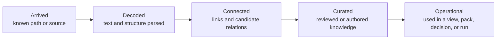

# Happy Desk UX Concept — The Knowledge Loom

**Status:** Signature interaction concept  
**Version:** 0.3  
**Date:** 2026-08-05  
**Decisions:** [GRILL-DECISIONS.md](GRILL-DECISIONS.md)  
**Brief:** [PRODUCT-BRIEF.md](PRODUCT-BRIEF.md)  
**Design system:** [design-system/happy-desk/MASTER.md](../design-system/happy-desk/MASTER.md)

## The proposition

Most knowledge tools split the experience into unrelated places:

- an import dialog;
- a progress spinner;
- a file browser;
- an editor;
- a graph visualization;
- an AI chat;
- an activity log.

The user is left to infer how information moved between them — and **context dies across switches**.

The Knowledge Loom makes transformation and continuity the interface itself.

> Information should visibly arrive, resolve into structure, connect to existing knowledge, become deliberately curated, and enter real work—without losing its identity or provenance between views. Threads of work should be leaveable and resumable without shame or reconstruction.

This is the foundational UX bet for Happy Desk. Ingestion, knowledge construction, visualization, and agent interaction are not separate features. They are stages of one observable lifecycle — oriented around **Thread Resume** for continuity and **Context Packs** for execution.

### Who this is for (v1)

**Alex:** AI-native builder with ADHD-pattern switching across many live projects. Needs externalized executive function, flow-safe exploration, and trustworthy agent context — without a judgment engine for unfinished work. See persona in the brief and D11 in grill decisions.

### Modes

| Mode | Trust friction | Job |
|---|---|---|
| **Orient / Resume** | Quiet | Land on a Thread; restore cursor; one-line “while you were away”; Weave closed |
| **Explore / Write** | Optional | Loom scales; Weave whisper→peek; proposals behind toggle |
| **Act** | Loud | Pack tab preferred; budget, exclusions, why-included |
| **Review** | Selective | File diff primary; high-impact knowledge deltas only |

**Rule:** Pack-first to act; Loom-first to orient; **Weave** for composition-time foresight. Day one does not teach three state axes, Atlas, or hop-ring theory.

## Why “Loom”

The name is an internal design metaphor, not vocabulary that must dominate the UI.

- Sources arrive as **threads**.
- Parsing and extraction reveal their internal structure.
- Relationships become **stitches** with evidence.
- Curated concepts, decisions, and projects form reusable **patterns**.
- Context Packs cut a purposeful piece of the fabric for a task.
- Agent work adds new material, which returns through the same observable process.
- The **Writing Feather (Weave)** lets you peek at stitches already around your focus and stitches your writing may produce — without leaving the page.

The metaphor matters because a graph shows connections but not how knowledge was made. A loom expresses both construction and structure — including foresight while composing.

## The six product breakthroughs


### 1. Ingestion is a visible transformation, not a waiting room

The workspace is useful immediately. Exact files and text become available before embeddings and inferred relationships finish. The UI shows which capabilities are ready for which parts of the workspace.

### 2. Every item keeps one identity across representations

A file does not become an unrelated search result, graph node, context chip, and agent attachment. It is the same selected object rendered at different semantic scales. Navigation preserves the anchor, history, and spatial context.

### 3. Knowledge has explicit states

Happy Desk distinguishes processing, trust, and use. It never compresses them into a misleading universal “knowledge score.”

### 4. AI suggestions enter as ghost structure

Extracted concepts and inferred edges appear as proposals: useful, explorable, and visibly non-canonical. They become durable knowledge only through evidence thresholds, repeated confirmation, or human promotion.

### 5. Visualization follows the question

Relationships use a network. Containment uses a hierarchy. Ingestion uses a process view. Evolution uses a timeline. Evidence uses a path. Density uses a heat map. Happy Desk does not force every question into a force-directed graph.

### 6. Context composition is visible on the knowledge surface

The Context Lens highlights the exact nodes and chunks an agent would receive. Freezing a Context Pack creates a visible boundary around that working set, with provenance and budget—not a hidden retrieval payload.

### 7. Composition can loom forward

While writing, Weave shows what is already woven to the focus and what the draft is likely to connect to — as anticipatory proposals, never as silent facts.

## One information lifecycle

Every ingestible item moves through five processing stages:




These stages describe processing and use, not truth or importance. An item may be fully decoded but untrusted; highly trusted but currently unused; operational in one project and irrelevant in another.

### Three independent state axes


| Axis        | Question                         | Example values                                                                |
| ----------- | -------------------------------- | ----------------------------------------------------------------------------- |
| Processing  | What has the system completed?   | discovered, parsed, embedded, linked, failed                                  |
| Epistemic   | How is this assertion supported? | authored, structural, inferred; proposed, accepted, disputed; confidence 0..1 |
| Operational | How is it used now?              | dormant, active, pinned, in Context Pack, modified in run                     |


Only one axis should dominate visual encoding at a time. The active Lens decides which axis is emphasized; the inspector always exposes all three in text.

## Threads, Home, and Capture

### Thread (unit of continuity)

A Thread bundles: title/intent, anchor (file, selection, Decision, or query), attached Open Loops, resume cursor (selection, scale, lens preset), optional last Context Pack, optional last agent-run summary. Projects may contain many Threads. Sessions are ephemeral; Threads persist. Context Packs are execution snapshots, not Threads.

### Home (compassionate subset)

Home shows **Active** Threads (≤7), **Recently touched** (capped), and **Needs you** only for those Threads. It refuses a global dump of all historical loops, workspace Atlas as default, and shame rankings of everything unfinished. Full mess is one deliberate click away (“Show all open loops”). Parking a Thread is first-class and guilt-free. Copy stays neutral and specific.

### Capture (≤2 seconds)

Universal gesture (shortcut + Build Shelf + command palette). Default create: **Open Loop** (or quick note) with timestamp, optional current anchor, provenance, state `inbox`. No ontology pick mid-impulse. Promote later (“Promote to Decision…”). v1 sources: editor selection, empty thought, agent output selection, search result.

### Act gravity without nagging

Every Thread has a visible **Act** affordance (compose/update pack → run, or mark next action). After meaningful wander, a dismissible “Freeze what you found?” may appear — never modal-blocking, never streaks or guilt timers.

## The continuous workspace

```text
┌──────────────────────────────────────────────────────────────────────────────┐
│ Home · Threads · workspace · branch · scope     Search / Capture    Health   │
├──────────────────────────────────────────────────────────────────────────────┤
│ Knowledge Pulse: capability coverage (exact / semantic / graph readiness)    │
├───────────────┬─────────────────────────────────────┬────────────────────────┤
│ Explorer      │ Continuous Knowledge Surface        │ Lens + Evidence        │
│ Files         │ Source ⇄ Structure ⇄ Neighborhood   │ Why is this here?      │
│ Threads       │              ⇄ Atlas (later)        │ Hops / strength / type │
│ Open loops    │ Same anchor, changing scale         │ Pack candidates        │
│ Review queue  │                                     │ Why · Weave · Pack     │
├───────────────┴─────────────────────────────────────┴────────────────────────┤
│ Build Shelf: capture · feather/weave · promote · relate · compose · Act      │
├──────────────────────────────────────────────────────────────────────────────┤
│ Optional Weave dock (under editor) · Agent Dock / Review · Time Rail         │
└──────────────────────────────────────────────────────────────────────────────┘
```

Right-rail tabs: **Why** (evidence) · **Weave** (feather peek) · **Pack** (candidates + budget). Mode picks the preferred tab; the user can override.

At minute five of a large repo: Explorer + editor + Pulse coverage + local authored/structural neighborhood. No global Atlas, no tens of thousands of ghost edges. Weave stays closed until invoked.

The four central scales are not disconnected tabs. The active object remains fixed while the representation changes.

### Scale 1 — Source

The actual Markdown, code, document page, image, transcript, or metadata. Selections can be addressed and cited.

### Scale 2 — Structure

Headings, blocks, symbols, extracted entities, decisions, tasks, claims, citations, and proposed relations inside the active source. This is where the user sees what the indexer understood.

### Scale 3 — Neighborhood

A stable local relationship map centered on the active item. Concentric rings represent graph hops, making distance legible instead of leaving it to a force-layout accident.

### Scale 4 — Atlas

A multi-resolution map of projects, topics, communities, and unresolved frontiers. It begins with aggregate regions and reveals individual nodes only through semantic zoom. The Atlas never opens as an all-node hairball.

## Signature interaction: Thread Resume with anchor continuity

**Crowned signature (D20):** Restore a Thread → same addressable object, cursor, scale, and enough local context to continue — in ≤30 seconds and ≤2 clicks from Home — then optionally Explore or Act.

Canonical path:

1. Open Happy Desk → Home Threads  
2. Click Thread → restore anchor + cursor + last scale  
3. Optional one-line “while you were away” (agent hangings / stale pack)  
4. Continue editing/exploring or Act  

No model literacy required on that path.

### Exploration amplifier: semantic zoom without losing the anchor

Important, not signature. The user can move Source → Structure → Neighborhood → Atlas by zoom, shortcut, or scale control. The selected object remains visually anchored; breadcrumbs preserve path.

**Identity contract:** Continuity is addressable identity + explicit rebinding — never silent retargeting. One span may parent many Decisions; source drift shows a re-link banner; breadcrumbs read `file › chunk › Decision`.

Example:

1. Resume Thread anchored on an architecture paragraph.
2. Zoom out once to see an extracted Decision proposal and its cited source span.
3. Promote it; the ghost object becomes authored and portable.
4. Zoom out to its two-hop neighborhood (authored/structural first).
5. Optionally enable proposals; accept one evidenced relation.
6. Return to Source; the original paragraph is still selected.

Motion communicates continuity through position and opacity over 150–250 ms. Reduced-motion mode replaces morphs with immediate transitions and persistent breadcrumbs.

## Composition signature: Writing Feather → Weave

**Second chair to Thread Resume (D21).** Graph distance, typed relationships, and a small vocabulary remain first-class. Weave is how those powers show up *while writing* — without making the hairball the home screen.

### Job

Given the current focus (caret, selection, or composing span), show:

1. **Woven** — relations that already exist (authored, structural, accepted).  
2. **Likely** — relations this draft may produce or collide with (anticipatory proposals).

So the user can loom into the fabric they’re touching and the fabric they’re about to weave — then return to the sentence without context death.

### How it sits in the UI (not another app)

```text
┌─────────────┬────────────────────────────────────┬──────────────────────┐
│ Explorer    │ Source editor (focus stays here)   │ Why │ Weave │ Pack   │
│             │  ……paragraph under caret……         │                      │
│             │ ▏ whisper ticks in gutter (opt)    │ Weave peek OR        │
│             ├────────────────────────────────────┤ under-editor dock    │
│             │ Weave dock (optional, Esc closes)  │                      │
└─────────────┴────────────────────────────────────┴──────────────────────┘
```

- **Why** — evidence for the selected candidate/edge.  
- **Weave** — feather peek for editor focus (Explore / write).  
- **Pack** — ranked Context Lens candidates + budget (Act).  

Build Shelf includes a feather control next to Capture. Shortcut and command palette: “Weave”. Tooltip: “Relations of this focus — woven and likely.”

### Intensity ladder (flow-safe)

| Level | UI | Behavior |
|---|---|---|
| **Whisper** | Gutter ticks / density marks | Optional; default off until first Weave use. Shape + count, not color alone. Debounce ≥400ms. Never steals focus. |
| **Peek** | Right-rail Weave tab or under-editor dock | Opens on invoke. Two bands: Woven \| Likely. List-first. Esc → caret. |
| **Enter** | Actions on a row | Open Neighborhood/Structure, Capture, Relate, Pin to pack (explicit), Suppress, Watch focus. |

### Peek layout

```text
Weave · focus: “use embedded index…”          [Woven|Likely|Both]
─────────────────────────────────────────────────────────────────
WOVEN (connected now)          LIKELY (may connect)
• Decision …  supports         ◦ Open Loop …  may close
  hop 1 · authored               anticipatory · semantic+loop
• notes/adr.md  links_to       ◦ Thread: spike  may join
─────────────────────────────────────────────────────────────────
Open neighborhood · Capture · Relate · Pin · Suppress
```

**Likely** rows always use dashed/dotted stitch language and verbs like “may close / may contradict / may mention.” They are never drawn as solid facts.

### Anticipation (honest v1 signals)

- Semantic neighbors of the current sentence or selection  
- Open Loops / Decisions that match or contradict the draft  
- Incomplete wiki/links under the caret  
- Opt-in co-pin history with this Thread/file  
- Weak: structural siblings when selection is empty (labeled)

Anticipatory items stay `proposed` / `anticipatory`. They do not enter default retrieval or packs until Pin / Relate / Promote.

### What Weave reuses from the graph stack

| Existing | Role inside Weave |
|---|---|
| Hops / neighborhood | “Open neighborhood” enter path; optional mini 1-hop ring later |
| Typed relation vocabulary | Row verbs (`supports`, `may contradict`, …) |
| Ghost grammar | Likely band shares dashed proposal styling |
| Context Pack | Only via explicit Pin |
| Capture | One-click from a Likely row → Open Loop |

### ND / instrument rules

- Typing never moves keyboard focus into Weave; open peeks refresh in place.  
- Home/Resume leaves Weave closed (switch-cost budget).  
- No shame counts of ignored likely links.  
- Reduced motion: no floating feather animation; instant panel.  
- Cap ~8–12 rows per band.  

Wireframes and tokens: [design-system/happy-desk/pages/weave.md](../design-system/happy-desk/pages/weave.md).

## Ingestion UX: the Knowledge Pulse


### Before indexing

Opening a folder never begins opaque or potentially expensive work without showing scope. A compact preflight reports:

- discovered files by type and size;
- ignored and secret-sensitive paths;
- supported, preview-only, and unsupported formats;
- local versus remote embedding provider;
- estimated local storage and remote data exposure, if any;
- Git branch/worktree and dirty-state context.

Safe local parsing can begin immediately. Remote embedding or extraction requires a visible scope decision.

### While indexing

The Knowledge Pulse is a thin, expandable status band—not a blocking modal.

Collapsed:

```text
● Building knowledge  2,130 / 2,481 decoded · semantic search 68% covered · 7 issues
```

Expanded:

```text
Discover       2,481 ready
Decode         2,130 ready · 44 active · 3 failed
Embed          1,694 ready · local model · 12.4 items/s
Connect          611 ready · 38,204 candidate edges
Review             9 contradictions · 143 proposed concepts
```

Important rules:

- Never show a fake percentage when the total is still growing.
- Show completed units, active work, queued work, and coverage by capability.
- Exact search becomes available after decoding; semantic search gains coverage progressively; graph features reveal available edge classes as they arrive.
- Pause, resume, cancel, retry, exclude, and lower-priority controls are always reachable.
- Errors appear beside the affected source with impact and recovery action.
- Background updates use polite accessibility announcements, not constant chatter.


### Visible construction

When the user watches an active region, newly decoded structure appears locally:

- a discovered artifact starts as a labeled outline;
- decoded headings or symbols appear inside it;
- candidate relationships arrive as dashed ghost edges;
- accepted or authored relationships become solid;
- use in a Context Pack adds an operational marker without changing trust.

The animation is optional. The same progression must be understandable from labels, patterns, icons, and the event list.

## Building knowledge: the Build Shelf

The Build Shelf turns content into explicit working knowledge without forcing ontology maintenance. **Capture** is always first-class (≤2s → Open Loop). **Weave** (feather) is composition-time foresight. Promotion is refine-later, not admission fee.

### Capture

Universal gesture → Open Loop or quick note with optional anchor and provenance. No type pick required mid-impulse.

### Weave

Invoke feather → Peek at Woven + Likely for the current focus. See [Composition signature: Writing Feather → Weave](#composition-signature-writing-feather--weave).

### Promote

Select text, a file, a graph node, or multiple results and promote it into:

- Concept
- Decision
- Open Loop
- Task
- Argument
- Source
- Deliverable

Promotion creates a portable object, a precise back-reference, and an authored relationship. The proposed object is previewed before it is written.

### Relate

Connect two selected objects with a small, typed relationship composer. It prioritizes the current vocabulary and shows an evidence field:

```text
[Decision: use embedded index] — supports → [Project: Happy Desk]
Evidence: architecture note, lines 42–57
Strength: strong       Validity: current
```

Drag-to-connect may be offered, but keyboard and command-palette paths are equally complete.

### Reconcile

Happy Desk actively surfaces seams rather than pretending the graph is clean:

- likely duplicate concepts;
- contradictory claims;
- superseded decisions;
- orphaned artifacts;
- relationships with weak evidence;
- objects whose sources disappeared.

Resolution is reversible and records provenance. Merging never destroys the original source records.

### Compose

The user can select a group of sources, concepts, decisions, or arguments and create a new note, brief, outline, or Context Pack. The new object starts with live source references, not copied text without lineage.

### Agent proposals

Agent-created knowledge enters the same system as user-created knowledge but with a proposed review state. A run review shows:

1. **File diff (primary)** — filesystem changes;
2. **Knowledge deltas (exception-based)** — high-impact new objects, relationships, contradictions; low-confidence bulk collapsed.

Accepting a file diff does not silently accept every semantic assertion derived from it. Unreviewed assertions remain proposed and stay out of default retrieval and packs.

## Meaningful visualization: a grammar, not a graph theme

Happy Desk visualizes the answer shape.


| User question                                  | Primary view                         | Accessible equivalent         |
| ---------------------------------------------- | ------------------------------------ | ----------------------------- |
| What is directly connected to this?            | Hop-ring network                     | Ranked adjacency/path list    |
| What is inside this project or file?           | Expandable hierarchy                 | Tree table                    |
| How did this information arrive and transform? | Process map / staged flow            | Stage table and event log     |
| How did this idea or decision evolve?          | Timeline                             | Chronological list            |
| Where is knowledge dense or missing?           | Aggregate heat map                   | Ranked coverage table         |
| Why is this assertion present?                 | Evidence path                        | Ordered provenance steps      |
| Where do sources disagree?                     | Comparison matrix                    | Grouped contradiction list    |
| What context will the agent receive?           | Highlighted boundary on current view | Ordered Context Pack manifest |


### The hop-ring neighborhood

The active anchor sits in the center. Ring 1 contains direct relationships; rings 2 and 3 contain successive hops. Node positions remain stable while filters change where possible.

```text
                  ┌──────────── hop 3 ────────────┐
                  │   ○          ○               │
          ┌────── hop 2 ─────────────────┐       │
          │       ○──────○               │       │
          │   ┌── hop 1 ───────┐         │       │
          │   │  ○───●───○     │         │       │
          │   │      anchor     │         │       │
          │   └─────────────────┘         │       │
          └───────────────────────────────┘       │
                  └───────────────────────────────┘
```

Graph distance is therefore visible without inspecting every edge. Strength may affect edge weight, but confidence and review state use separate patterns or markers. Color never carries all meaning.

### The Atlas

The Atlas is a semantic map, not a global graph dump:

- Level 1: workspace regions such as projects and knowledge domains.
- Level 2: communities, work-object types, and active fronts.
- Level 3: important nodes and bridges.
- Level 4: the local hop-ring neighborhood.

Regions show aggregate signals selected by the active Lens: activity, unresolved questions, source coverage, contradiction density, or agent attention. Users can always switch to a sortable table containing the same aggregates.

### Ghost structure

Visual grammar for proposal state:

- authored or accepted: solid form;
- structural derivation: solid form with source marker;
- inferred proposal: dashed boundary or edge plus “proposed” label;
- disputed: split marker plus explicit label;
- suppressed: hidden by default, visible in review mode;
- stale: time marker and warning, not reduced opacity alone.

**Default neighborhood: authored + structural only.** Inferred ghosts are capped, local, and behind “Show proposals” / Review queue. Unreviewed proposals never enter default retrieval or Context Packs. Ignoring a proposal class may auto-suppress similar low-evidence bulk. Ghosts are a local review inbox, not ambient wallpaper.


## Context Lens integration

The Context Lens is not a right-hand filter panel disconnected from the visualization. It is a live query over the current surface.

When hops move from 1 to 2:

- the second ring unfolds;
- the ranked candidate list adds those items;
- paths and score components appear on selection;
- the token/size budget updates;
- excluded privacy scopes remain visibly blocked.

When the user freezes a Context Pack:

- included items receive a temporary boundary on the surface;
- the exact retrieval revision and source hashes are captured;
- out-of-budget candidates remain visible outside the boundary;
- stale items are flagged before an agent is launched;
- the pack can be inspected as a normal ordered manifest.

Users must be able to build a great pack from the **ranked candidate list + pins + budget alone**. Loom scales amplify hard cases; they are not prerequisites for packing. This makes agent context a visible construction, not invisible RAG.

## Progression over time: the Time Rail

The Time Rail records meaningful transformations:

- source added or changed;
- object promoted;
- relationship accepted, disputed, or superseded;
- Context Pack frozen;
- agent run started and completed;
- files and knowledge objects changed by a run.

Scrubbing time can preview an earlier graph projection without changing files. Restoring content remains a Git/filesystem operation with normal review. The Time Rail is for understanding and navigation, not a second version-control system.

## The unresolved frontier

The most useful global view may be what the workspace does **not** know cleanly.

The Frontier Lens ranks:

- important nodes with missing sources;
- contradictions near active projects;
- decisions lacking rationale;
- orphaned research;
- frequently retrieved but uncurated concepts;
- agent-generated assertions awaiting review;
- disconnected clusters that may need a bridge.

This changes the graph from an archive visualization into a work generator.

## Visual design direction

See [design-system/happy-desk/MASTER.md](../design-system/happy-desk/MASTER.md) as the implementation source of truth (ui-ux-pro-max informed; purple AI-chat defaults explicitly rejected).

### Character

Calm, exact, professional, and instrument-like. High information density with disciplined whitespace. Closer to a good debugger, mapping tool, or audio workstation than a social knowledge app or chatbot shell.

### Foundations

- Light base: `#F8FAFC`; dark text: `#020617`.
- Dark base: `#0F172A`; light text: `#F8FAFC`.
- Primary action/focus: `#0369A1` (light) / `#38BDF8` (dark), checked for contrast.
- Neutral structure: slate scale; semantic colors reserved for active Lens meanings.
- Typography: IBM Plex Sans for interface and reading, IBM Plex Mono for paths, IDs, scores, and code.
- Icons: Lucide SVG; no emoji as interface controls.
- Corners and shadows restrained; no glassmorphism, neon graph glow, decorative gradients, or floating-card excess.
- Motion: 150–250 ms for continuity; transforms and opacity only; reduced-motion support.
- Default: no marketing cards — panes, rows, and lists.


### Density

- Comfortable and compact density modes.
- Important controls at least 40 px on desktop and 44 px in touch mode.
- Resizable panes preserve minimum readable widths.
- Editor body line length targets 65–75 characters when not in code mode.


## Accessibility is structural

A visual graph cannot be the only way to understand or manipulate knowledge.

- Every visualization has a synchronized tree, table, list, or ordered path representation.
- Keyboard focus can move by next/previous node, parent/child, inbound/outbound relation, and hop ring.
- Selecting an item announces title, type, processing state, review state, and relationship to the anchor.
- Async progress uses a throttled `aria-live="polite"` summary.
- Node type uses shape/icon/text as well as color.
- Edge confidence and review state use pattern/marker/text as well as color or opacity.
- Canvas pan and zoom never trap focus.
- All drag interactions have command and keyboard alternatives.
- Reduced-motion mode keeps spatial breadcrumbs and skips morph animation.


## Performance behavior is part of the UX

- Render aggregates before individual nodes.
- Use level-of-detail thresholds and stable layout snapshots.
- Cap the default neighborhood at 300 nodes and explain when aggregation occurs.
- Virtualize candidate, event, and adjacency lists.
- Batch index updates into comprehensible UI pulses rather than moving the graph for every edge.
- Keep editing responsive even when parsing and embedding are saturated.
- Preserve reserved layout space so async panels do not jump.


## End-to-end storyboard

### Scene 1 — Open / Home

The user opens a repository. Explorer and Home Threads appear immediately. Knowledge Pulse shows capability coverage without blocking. Compassionate Active + Recent Threads — not the full mess.

### Scene 2 — Resume

Alex clicks a Thread. Anchor, cursor, and last scale restore within the switch-cost budget. A one-line “while you were away” notes an agent left two claims to review.

### Scene 3 — Observe

Source mode works now. Structure reveals headings and open loops as decoding completes. Ghost concepts stay behind proposals unless enabled.

### Scene 4 — Capture / Build

A stray thought is Captured as an Open Loop in under two seconds. Later, a sentence is promoted to a Decision with a precise source link. A structural relation is accepted; speculative merges stay proposed.

### Scene 5 — Explore

Neighborhood (authored/structural) shows one-hop sources; a second hop reveals a contradictory note. Evidence explains both paths. Optional “Freeze what you found?” appears dismissibly.

### Scene 6 — Act

Context Lens ranked list: lower semantic weight, exclude archive, pin decision + sources, freeze pack. Boundary visible. Codex/Claude Code runs; Agent Dock shows native progress.

### Scene 7 — Review

File diff is primary. Knowledge panel highlights high-impact deltas only; low-confidence bulk stays collapsed. Accepting files does not accept inferences.

### Scene 8 — Switch and return

Alex switches to another Thread mid-day, parks the first without drama, and later resumes both without reconstructing from anxiety.

## Prototype that should be built first

Do not prototype the entire desktop shell. Prototype the falsifying sequence:

1. Home Threads resume (cursor restore) — **required**;
2. progressive ingestion / Knowledge Pulse coverage;
3. explainable local neighborhood (list OK; hop-ring optional);
4. Capture → Open Loop;
5. optional promote passage → Decision;
6. tune Context Lens ranked list and freeze a Context Pack;
7. one native harness run;
8. file diff + selective knowledge proposals.

**May omit for Kill tests:** Atlas, Time Rail scrubbing, full semantic-zoom choreography, hop-ring polish, full reconcile UI, Weave whisper ticks.

**After Kill tests:** Weave Peek (two bands, invoke) is the next prototype slice for exploration love.

## Validation questions and kill tests

**Kill test A — Cold resume + act:** 10+ days away → within 5 minutes trusted pack + one native run → prefer vs manual reconstruction.  
**Kill test B — Multi-thread switching:** ≥3 Threads in one session, each recoverable later without anxiety.  
**Switch-cost targets:** after ≥24h away (and spot-check 10+ days), ≤30s and ≤2 clicks from Home to restored cursor.

Also test with repo + agent-CLI users:

1. Can they tell what is usable while indexing is incomplete?
2. Can they resume a Thread without learning ontology or three state axes?
3. Can they build a pack from the ranked list alone?
4. Can they predict exactly what the agent will receive?
5. Can they review without accepting every AI inference?
6. Does Home feel compassionate rather than shaming?
7. Does Capture beat reconstruction anxiety for impulses?

## Non-negotiable acceptance criteria

- No blocking ingestion wizard after safe local preflight on a known workspace.
- No single “AI confidence” color or universal knowledge-quality score.
- No global force-directed graph as the default workspace view.
- No invisible agent retrieval payload.
- No inferred relationship without evidence and source type.
- No unreviewed proposals in default retrieval or packs.
- No visual-only operation without a keyboard and structured-data equivalent.
- No automatic promotion of model assertions into canonical knowledge.
- No indexing animation that compromises editor responsiveness.
- No shame copy or gamified neglect pressure on Home.
- No mail/calendar/chat/OS-shell IA until Kill tests A and B pass.

## Design maxim

> Do not visualize the database. Visualize how information becomes usable, how work resumes across switches, why it is connected, and what the user can do next.

